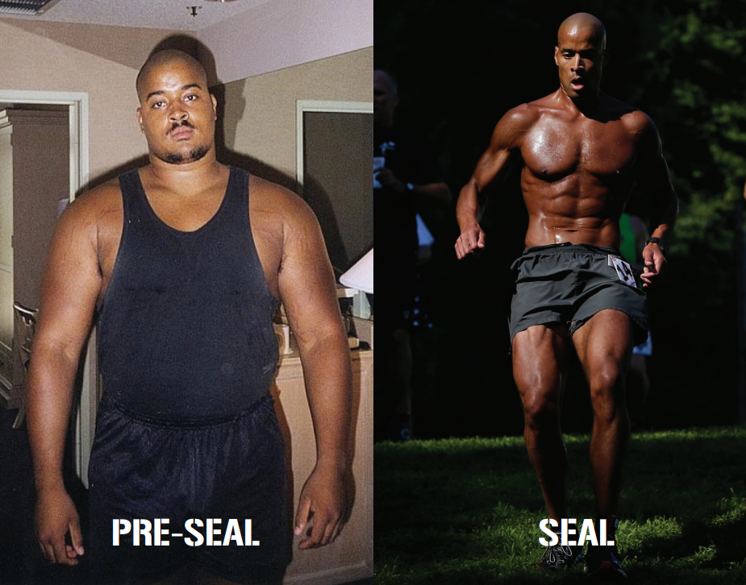

Today I tried rebuild the about david goggins site. From a blank document to this I needed 40min. I used the new things I learned but also used old.

<!DOCTYPE html>
<html>
    <head lang="en">
        <meta charset="utf-8">
        <meta name="og:type" content="website"/>
        <meta name="og:title" content="About David Goggins"/>
        <meta name="og:image" content="https://www.bing.com/th/id/OIP.lwF23esL7W-zwUGFFt1NfgHaJS?w=186&h=211&c=8&rs=1&qlt=90&o=6&dpr=1.5&pid=3.1&rm=2"/>
        <meta name="og:url" content="https://davidgoggins.com/about/"/>
        <meta name="description" content="About David goggins and his live"/>
        <title>ABOUT GOGGINS</title>
    </head>
    <body>
        <main>
            <section>
                
                <h1>THERE IS ONLY ONE  DAVID GOGGINS</h1>

            </section>
            <section>
                
<strong>David Goggins is a Retired Navy SEAL</strong> and the only member of the U.S. Armed Forces to complete SEAL training, Army Ranger School, and Air Force Tactical Air Controller training.

            </section>
            <section>
                <h2>
                    PUSHING THE LIMIT
                </h2>
                

                
Goggins has completed more than seventy ultra-distance races, often placing in the top-five, and is a former Guinness World Record holder for completing 4,030 pull-ups in seventeen hours.

                
A sought after public speaker, he’s traveled the world sharing his philosophy on how to master the mind. When he’s not speaking, he works as an Advanced Emergency Technician in a big city Emergency Room and, during the summer, as a wildland firefighter in British Columbia.

                

                
                <a href="https://davidgoggins.com/athletic-achievements/">READ MORE ABOUT DAVID'S ATHLETIC ACHIEVEMENTS</a>
            </section>
            <section>
                <h1>
                    GOGGINS GOES  BEYOND LIMITS
                </h1>
                
The pain that you are willing to endure is measured by how bad you want it.

                <iframe width="560" height="315" src="https://www.youtube.com/embed/knIIrbozmts" title="U.S. Navy Seal David Goggins:  &quot;No Limits&quot;" frameborder="0" allow="accelerometer; autoplay; clipboard-write; encrypted-media; gyroscope; picture-in-picture; web-share" referrerpolicy="strict-origin-when-cross-origin" allowfullscreen></iframe>
            </section>
        </main>
    </body>
</html>
