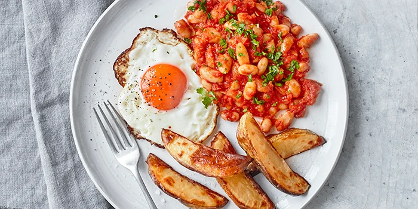

I did this website in 51min. I know it is easier as the goggins site but i focused on a clean semantic look. I used ruby article and some semantic laws.

<!DOCTYPE html>
    <html lang="en">
        <head>
            <meta charset="utf-8">
            <title>BBC Food</title>
        </head>
        <body>
            <header>
                
<a href="#">Subscribe</a> | <a href="#">Sustainability</a> | <a href="#">Good Food Shows</a> | <a href="#">GF x Gousto</a> | <a href="#">Download our app
</a> | <a href="#">GF x Laithwaites Wine</a>

                
                 

            </header>
            <main>
                <article>
                    <section class="Introduction">
                        
                        <h1>How to fry an egg</h1>
                        <a href="#">Good Food team</a>  
                        <a href="#">2 comments</a>  
                        <a href="#">Try the Good Food app - subscribe today</a>
                        
Achieve the perfect fried egg with a crispy bottom and runny yolk. Simple yet satisfying, it can be enjoyed in a variety of dishes from breakfast to dinner.

                    </section>

                    <section class="Informations">
                        
Fried <a href="#">eggs</a> are an essential part of so many cuisines. Just consider a full English breakfast – it really isn’t the same with scrambled or poached. Further afield, a fried egg is de rigueur for a classic French croqué Madame, or a German schnitzel à la Holstein while, in exotic Indonesia, they are the crowning glory for <ruby>
  ナシ<rt>nasi</rt>
</ruby>
<ruby>
  ゴレン<rt>goreng</rt>
</ruby>
.

                        
Sunny-side up, a <a href="#">fried egg</a> will cheer up a salad and go equally well with different grains and lentils. They are an excellent takeaway food slotted into burgers, pitta bread, bacon sarnies and Indian naan or roti, if you so desire. Your only decision is whether to cook them with a softly set white and just cooked yolk (see below), a frill of crispness around the edge (turn the heat up when cooking them) or over-easy (flipped to make sure the white is fully cooked). The yolk should <strong>always</strong> be soft.

                        
Choose the freshest eggs and note that hens' eggs are slightly easier to cook than ducks' eggs. The fresher an egg, the stronger the proteins are in the white, which means the egg will form into a neater shape in the frying pan. Old eggs will spread out very thinly.

                        
You can fry an egg in any fat but choose one that will give you the flavour you want. For example, at breakfast you might use the bacon fat left in the pan or a knob of butter. If adding the egg to a rich dish, olive or rapeseed oil may work better, while for nasi goreng or dhal you may like the hint of coconut that comes from using coconut oil.

                    </section>
                    <section class="Recepie">
                        <h2>Basic recipe for a fried egg</h2>
                        <h3>Serves 1 (easily doubled)</h3>
                        <h3>Ingridients</h3>
                        <ul>
                            <li>1 fresh egg at room temperature</li>
                            <li>1 small knob of butter or 1 tbsp oil</li>
                        </ul>
                        <h3>Sunny-side up method</h3>
                        <ol>
                            <li>Heat the butter until it melts but isn’t yet hot enough to brown (or heat the oil).</li>
                            <li>Crack the egg onto a small plate or saucer (don’t crack it straight into the pan in case some shell ends up in there as well). Slide it off the saucer into the pan.</li>
                            <li>Cover with a lid and leave for 3 minutes over a low heat. Check the white is set and, if not, leave it for another 30 seconds and check again. The whites should be set but you should still have a runny yolk.</li>
                            <li>Season.</li>
                        </ol>
                         
                        
Watch our video for step-by-step instructions on achieving perfect fried eggs

                        <iframe width="807" height="454" src="https://www.youtube.com/embed/smYfx1r6eYI" title="How to make the perfect scrambled eggs" frameborder="0" allow="accelerometer; autoplay; clipboard-write; encrypted-media; gyroscope; picture-in-picture; web-share" referrerpolicy="strict-origin-when-cross-origin" allowfullscreen></iframe>
                    </section>
                </article>
            </main>
            <footer>

            </footer>
        </body>
    </html>
