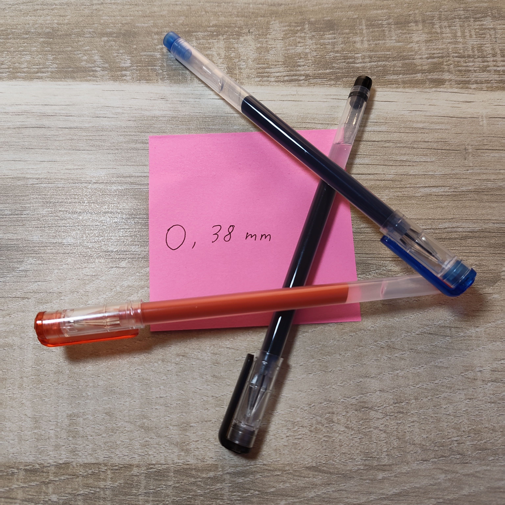
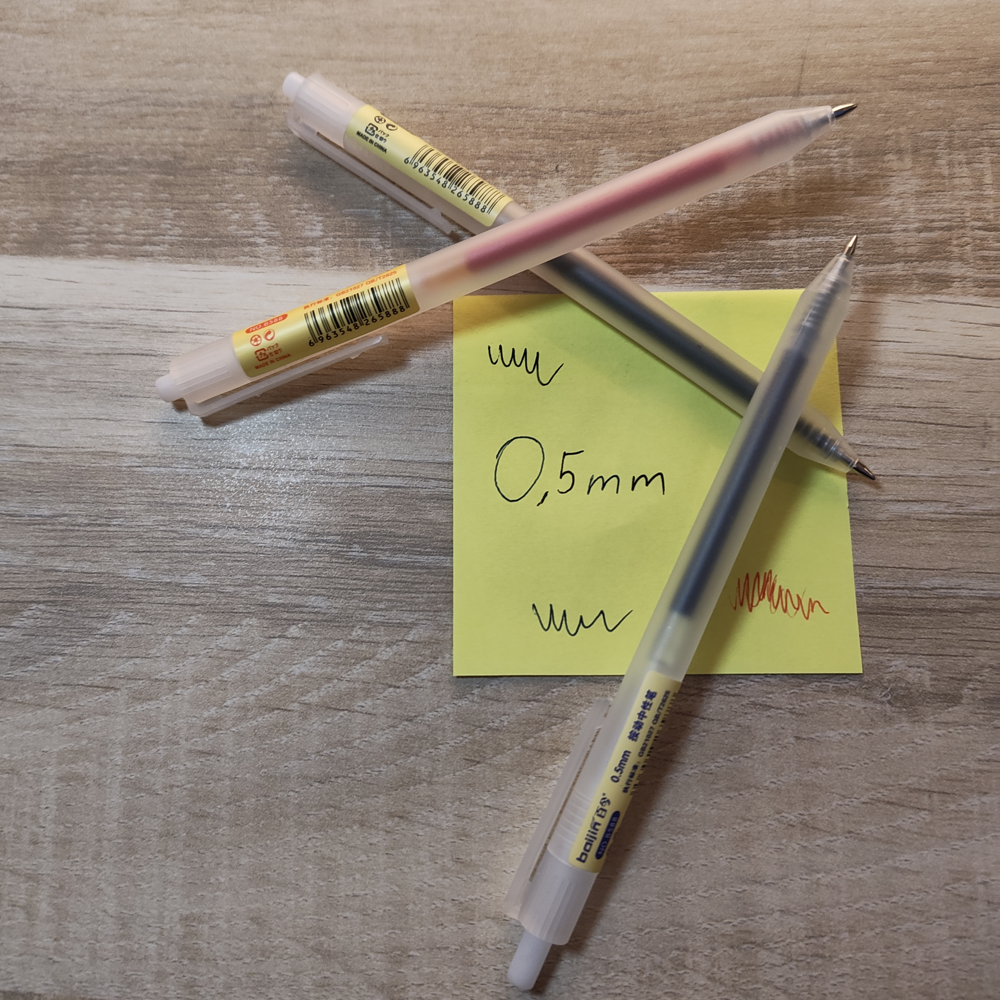
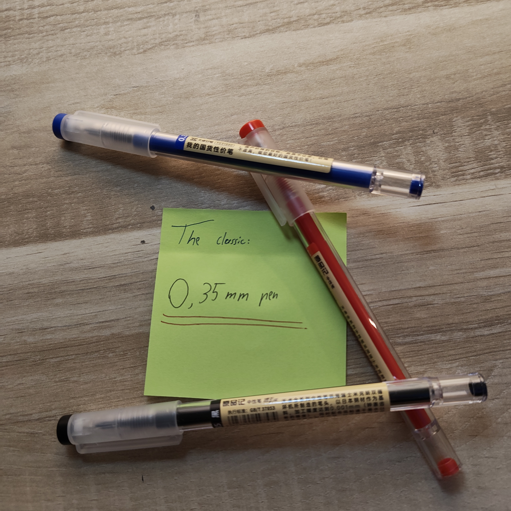
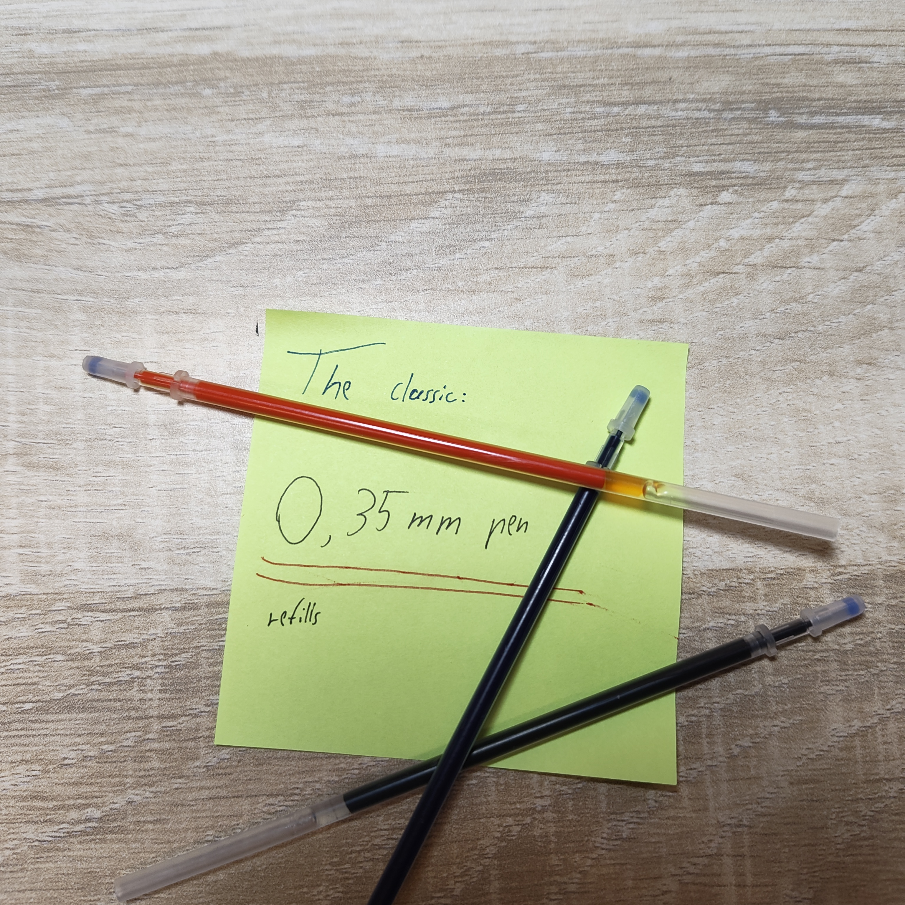

Today Is saturday and like everytime I optimize Bungu. Today I added a table, a textarea, a radio input and an select option to the penshop. I looks good!

<!DOCTYPE html>
<html lang="en">
    <head>
        <meta charset="utf-8">
        <title>Bungu-Penshop</title>
        <meta name="description" content="Pen store Bungu with good and cheap asian pen's">#
        <meta property="og:type" content="website">
        <meta property="og:title" content=">Bungu pen store">
        <meta property="og:url" content="Bungu_pens.com">
        <meta property="og:image" content="Pictures/head.jpg">
    </head>
    <body>
        <main>
        <section class="Welcoming">
            <h1>Welcome to <strong><ruby>文<rt>Bun</rt>具<rt>Gu</rt></ruby></strong></h1>
            <h2><q cite="https://www.azquotes.com/quote/1032579?ref=pens">The pen is the lever that moves the world.</q></h2>
            <figure>
                
                <figcaption>Well isn't this exciting? Are you ready to choose your new Friend?</figcaption>
            </figure>
        </section>
        <nav>
            <section class="table of contents">
                <h2>Table of <em>Products</em></h2>
                <a href="#BestValue">Best Value</a>
                <ul>
                    <li><a href="#0,38_budget">0,38mm budget pen's</a></li>
                    <li><a href="#0,5_budget">0,5mm budget pen's</a></li>
                </ul>
                <a href="#classics">The classics</a>
                <ul>
                    <li><a href="#0,35_pens">The classic 0,35mm pen's</a></li>
                    <li><a href="#0,35_refills">The classic refills</a></li>
                </ul>
                <a href="#reviews">Reviews</a>
                <ul>
                    <li><a href="#neal">Neal's review</a></li>
                    <li><a href="#tony">Tony's review</a></li>
                    <li><a href="#make_yours">Make your own</a></li>
                </ul>
             

            </nav>
        </section> 
        <section>
            <table>
                <caption>Pen-Table</caption>
                <thead>
                    <tr>
                        <th>Pen</th>
                        <th>Price</th>
                        <th>Note</th>
                    </tr>
                </thead>
                <tbody>
                    <tr>
                        <td><a href="#0,38_budget">0,38mm budget pen's</a></td>
                        <td>0,79€</td>
                        <td>Good and cheap pens for thin work.</td>
                    </tr>
                    <tr>
                        <td><a href="#0,5_budget">0,5mm budget pen's</a></td>
                        <td>0,99€</td>
                        <td>The normal pen. Something for everybody, everytime.</td>
                    </tr>
                    <tr>
                        <td><a href="#0,35_pens">The classic 0,35mm pen's</a></td>
                        <td>for one: 1,50€  for three: 3,00€</td>
                        <td>Great writing and good for thin work but also normal writing.</td>
                    </tr>
                    <tr>
                        <td><a href="#0,35_refills">The classic refills</a></td>
                        <td>0,79€</td>
                        <td>If your classic is empty these are great refills.</td>
                    </tr>
                </tbody>
                <tfoot>
                    <tr>
                        <th colspan="3">Total pens: 3</th>
                    </tr>
                </tfoot>
            </table>  
 
        </section>
            <section id="BestValue">
                <h2>Best Value</h2>
                    

                        You can't get more time. But you can get more value... maybe with these pens.
                    

        <section id="0,38_budget">
            
                
Price: 0,79&euro;

                <button class="add-to-cart">Add to cart</button>
        </section>
        <section id="0,5_budget"></section>
            
                
Price: 0,99&euro;

                <button class="add-to-cart">Add to cart</button>
       </section>
       <section id="classics">
        <section id="0,35_pens">
            <h2>The classics</h2>
            
            <ul>
                <li>Price for one: 1,50&euro;</li>
                <li>Price for three: 3,00&euro;</li>
            </ul>
            <button class="add-to-cart">Add one to cart</button>
            <button class="add-to-cart">Add three to cart</button>
        </section>
        <section id="0,35_refills">
            <h3>Is your classic empty? Hopefully not you!</h3>
            
            
Buy one for 0,79&euro;

            <button class="add-to-cart">Add to cart</button>
        </section>
       </section>
        

        <section class="review" id="reviews">
            <h2>Reviews</h2>
            <figure id="neal">
                <iframe width="774" height="435" src="https://www.youtube.com/embed/YqXXMqpWvZY" title="0 35 mm Black Gel Ink Pen Review &amp; Unboxing" frameborder="0" allow="accelerometer; autoplay; clipboard-write; encrypted-media; gyroscope; picture-in-picture; web-share" referrerpolicy="strict-origin-when-cross-origin" allowfullscreen></iframe>
                                <figcaption><dl>
                    <dt>Neal</dt>
                    <dd>Neal sais Thumbs up!</dd>
                </dl></figcaption>
            </figure>
            </figure>
            <figure id="tony">
                <iframe width="774" height="435" src="https://www.youtube.com/embed/VtKJl9E64hI" title="Chinco 12 Pieces 0 35 mm Black Gel Ink Pen Extra Fine Ballpoint Pen for Office School Stationery Sup" frameborder="0" allow="accelerometer; autoplay; clipboard-write; encrypted-media; gyroscope; picture-in-picture; web-share" referrerpolicy="strict-origin-when-cross-origin" allowfullscreen></iframe>
                <figcaption><dl>
                    <dt>Tony</dt>
                    <dd>Tony likes the smothe ink flow and thinks these are good pens.</dd>
                </dl></figcaption>
            </figure>
            <section id="make_yours">
                <h2>Make your review</h2>
                     <form action="" method="post">              
                <fieldset>
                <legend>Your review</legend>
                        <label for="name">Your name:</label>
                        <input id="name" type="text">
                        <label for="product">Your product:</label>
                        <input id="product" type="text">
                        <label for="star">How many stars would you give the pens?</label>
                        <select id="star" name="stars">
                            <option name="stars">1 star</option>
                            <option name="stars">2 stars</option>
                            <option name="stars">3 stars</option>
                            <option name="stars">4 stars</option>
                            <option name="stars" selected>5 stars</option>
                        </select>
                        <label for="note">Notes (optional):</label>
                        <textarea id="note"></textarea>
                    <button>Submit</button>
                </fieldset>
                    </form>
            </section>
        </section>
       </main>
    </body>
</html>
