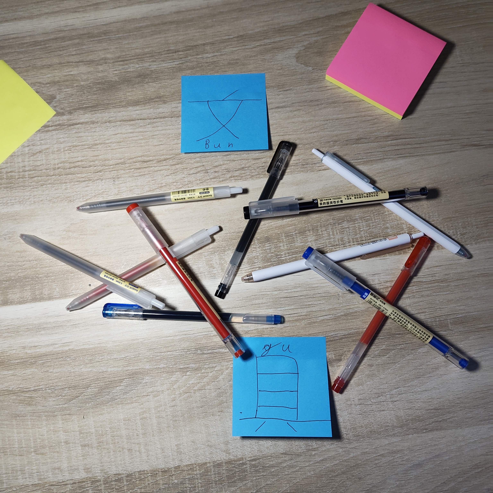
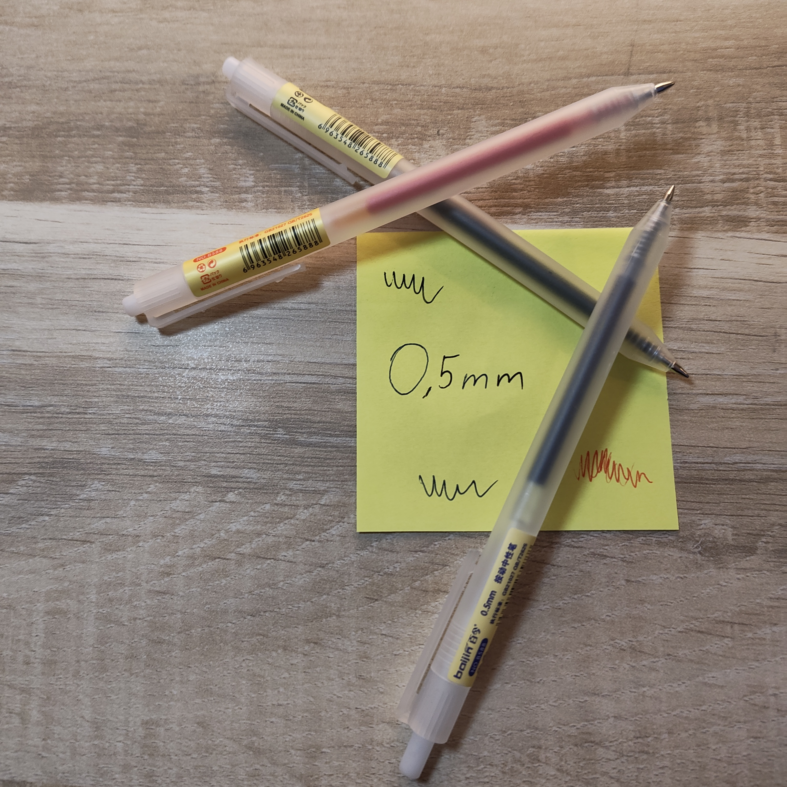
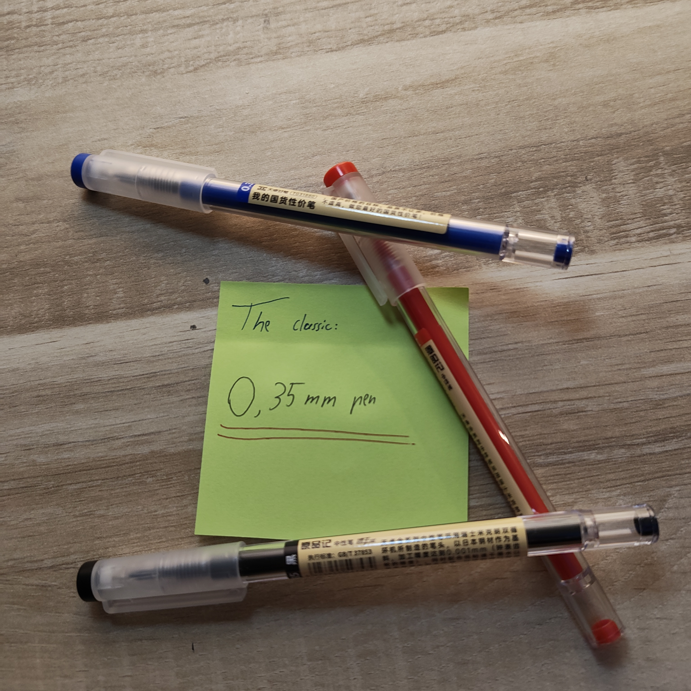
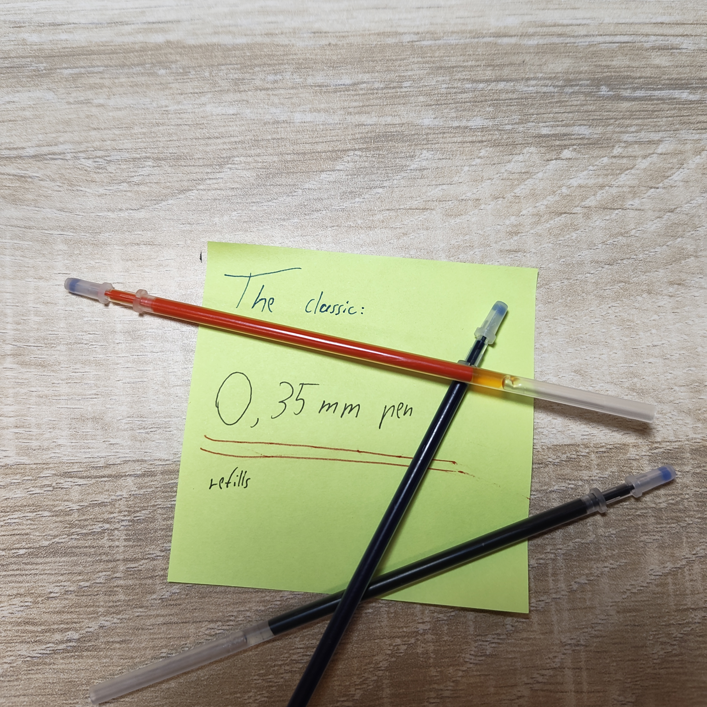

Today is saturday. And every saturday I'm are going to enhance the website I did last week with the things I learned this week.
But today was the first saturday so I did a new site.

# Today I did:
<!DOCTYPE html>
<html lang="en">
    <head>
        <meta charset="utf-8">
        <title>Bungu-Penshop</title>
    </head>
    <body>
        <section class="Welcoming">
            <h1>Welcome to <strong>文具</strong></h1>
            <figure>
                
                <figcaption>Well isn't this exciting? Are you ready to choose your new Friend?</figcaption>
            </figure>
        </section>
        <section>
            <section class="table of contents">
                <h2>Table of <em>Products</em></h2>
                <a href="#BestValue">Best Value</a>
                <ul>
                    <li><a href="#0,38_budget">0,38mm budget pen's</a></li>
                    <li><a href="#0,5_budget">0,5mm budget pen's</a></li>
                </ul>
                <a href="#classics">The classics</a>
                <ul>
                    <li><a href="#0,35_pens">The classic 0,35mm pen's</a></li>
                    <li><a href="#0,35_refills">The classic refills</a></li>
                </ul>
            </section>
        </section>
            <section id="BestValue">
                <h2>Best Value</h2>
                    

                        You can't get more time. But you can get more value... maybe with these pens.
                    

        <section id="0,38_budget">
            
                
Price: 0,79&euro;

                <button class="add-to-cart">Add to cart</button>
        </section>
        <section id="0,5_budget"></section>
            
                
Price: 0,99&euro;

                <button class="add-to-cart">Add to cart</button>
       </section>
       <section id="classics">
        <section id="0,35_pens">
            <h2>The classics</h2>
            
            <ul>
                <li>Price for one: 1,50&euro;</li>
                <li>Price for three: 3,00&euro;</li>
            </ul>
            <button class="add-to-cart">Add one to cart</button>
            <button class="add-to-cart">Add three to cart</button>
        </section>
        <section id="0,35_refills">
            <h3>Is your classic empty? Hopefully not you!</h3>
            
            
Buy one for 0,79&euro;

            <button class="add-to-cart">Add to cart</button>
        </section>
       </section>
    </body>
</html>
