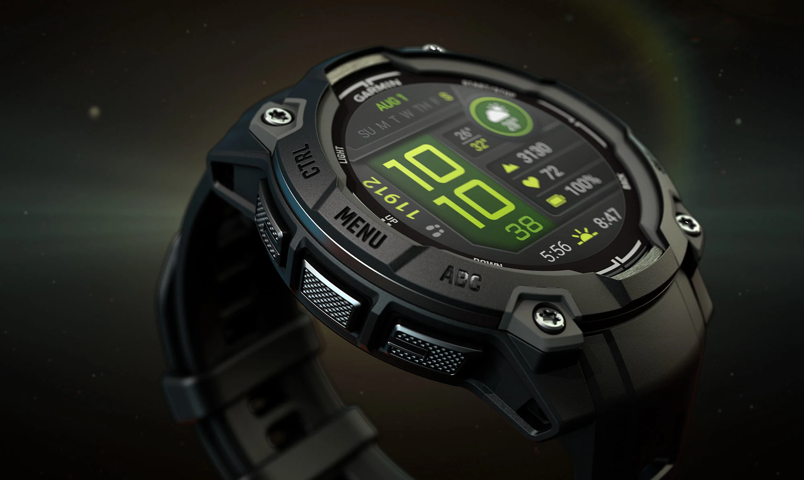
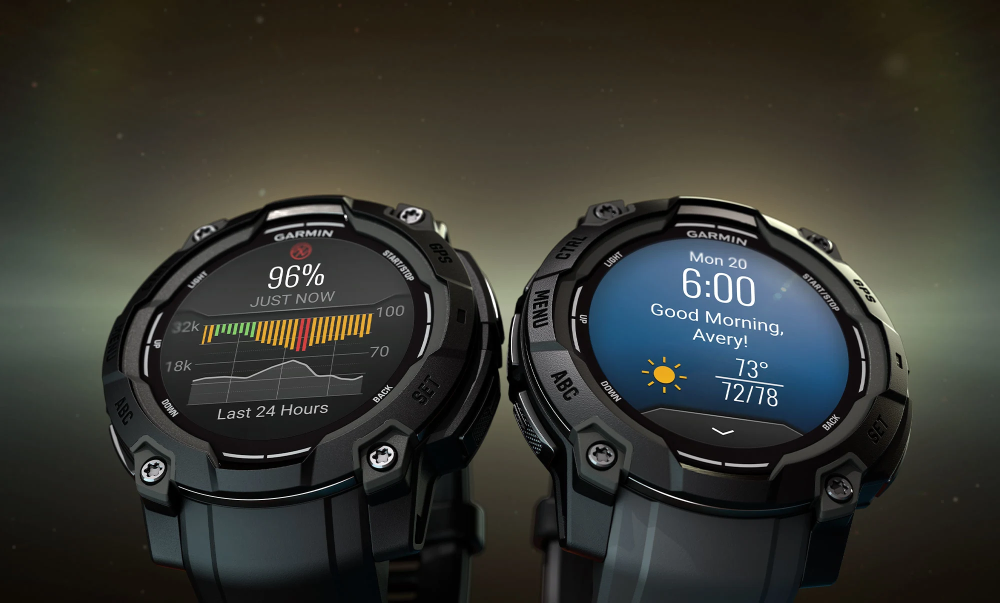
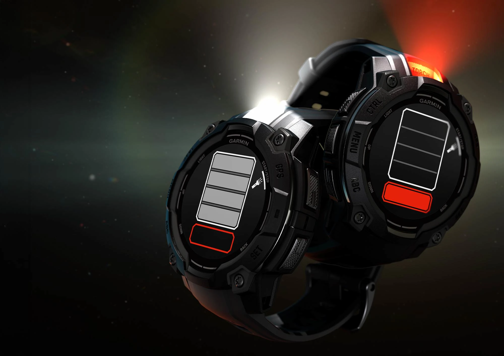
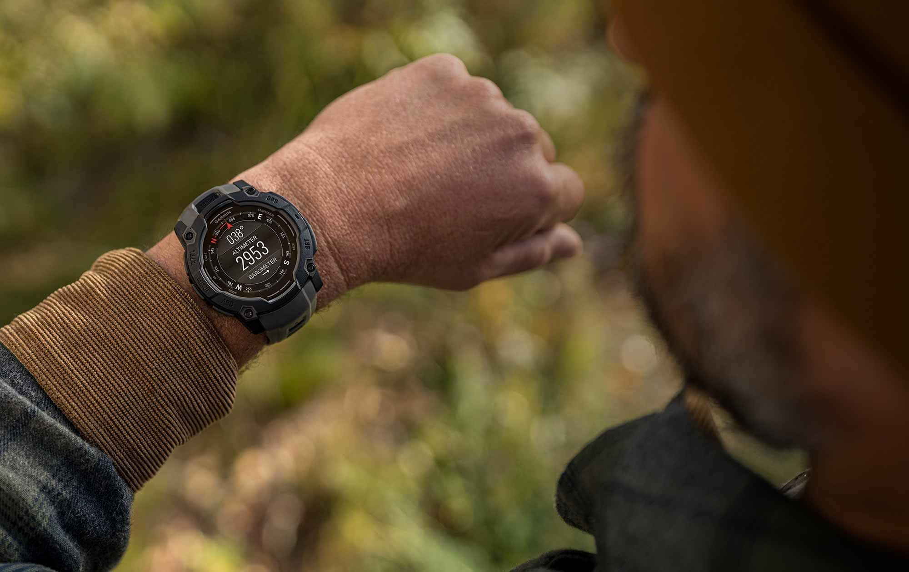

So today I made a garmin side of the watch I bought on friday. When I'll be better in css I will make the text inside the picture.
The style-file is garmin-instinct.css             The pictures are every that are named with insinct and instinct

<!DOCTYPE html>
<html lang="en">
<head>
    <meta charset="UTF-8">
    <meta name="viewport" content="width=device-width, initial-scale=1.0">
    <title>Instinct 3</title>
    <meta name="description" content="Garmin's Instinct 3, the best watch for outdoor activities.">
    <link rel="stylesheet" href="CSS/garmin-instinct.css">
</head>
<body>
    

    <a href="#" class="directions" id="first">OVERVIEW</a>
    <a href="#" class="directions">SPECS</a>
    <a href="#" class="directions">IN THE BOX</a>
    <a href="#" class="directions">ACCESSORIES</a>
    <a href="#" class="directions" id="last">COMPATIBLE DEVICES</a>
    

    <!--  -->
     

        
        

        <h2>FOLLOW   YOURS</h2>
        
INSTINCT® 3

        

     
  

        
        

        <h2>TOUGH  IT OUT</h2>
        
Metal-reinforced bezel

        

     
    

        
        

        <h2>TAKE IN THE VIEW</h2>
        

Bright and vibrant AMOLED display

        

     
         

        
        

        <h2>STAY IN   THE KNOW</h2>
        
24/7 health and wellness monitoring

        

     

     

        
        

        <h2>CARRY   THE TORCH</h2>
        
Built-in flashlight

        

     

        
        

        <h2>BOLDLY GO</h2>
        
Multi-band GPS with SatIQ™ technology

        

     

     

        <iframe width="100%" height="500px" src="https://www.youtube.com/embed/BIs1kw1y_Fc" title="Garmin | Instinct 3 Smartwatch-Serie" frameborder="0" allow="accelerometer; autoplay; clipboard-write; encrypted-media; gyroscope; picture-in-picture; web-share" referrerpolicy="strict-origin-when-cross-origin" allowfullscreen></iframe>
     

</body>
</html>
